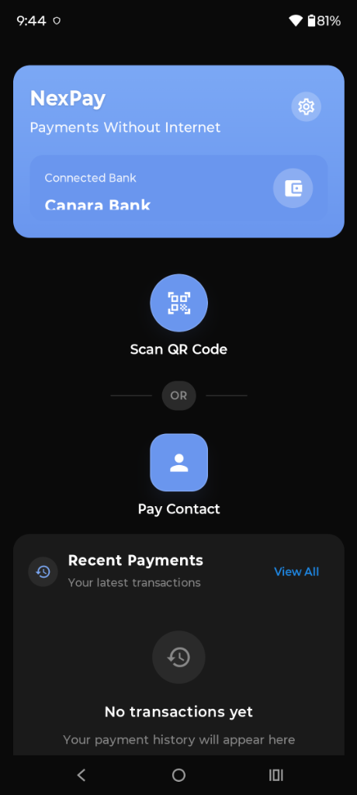
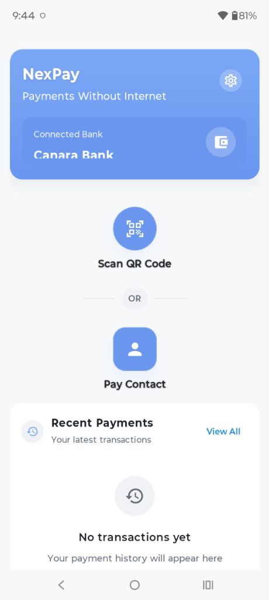
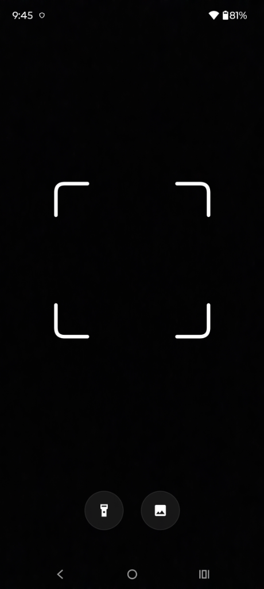
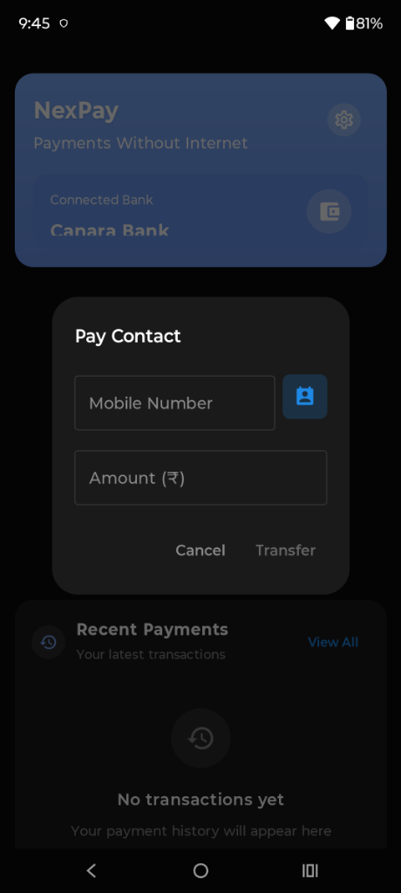
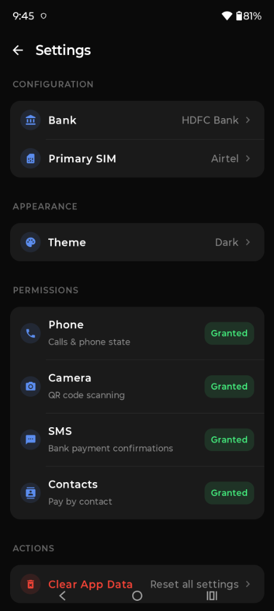

# NexPay
### Payments Without Internet

A modern Android application designed around offline payment flows using mobile network-based payment mechanisms, with payment confirmation handled through bank SMS verification.

`Offline-first` · `Android` · `Kotlin` · `Jetpack Compose` · `UPI` · `USSD` · `UPI 123PAY`

<p align="center">
  
</p>

---

## Overview

UPI digital payments are fundamental to daily commerce across India. However, payments consistently fail when smartphones enter low-signal environments, crowded marketplaces, rural zones, or during cellular data congestion.

**NexPay** addresses this connectivity gap by bridging modern smartphone design with India's existing telecom-native payment infrastructure:
1. **`*99#` USSD (NUUP)** — the GSM cellular signalling branch.
2. **UPI 123PAY (IVR)** — the national voice-call payment rail operated by NPCI.

NexPay wraps these telecommunications protocols in a clean, accessible Jetpack Compose interface. The application requires **no internet permission**, manages no external servers, collects no telemetry, and verifies transaction outcomes authoritatively on-device using incoming official bank SMS messages.

> **Project Origin & Attribution**: NexPay is developed as an adapted and modified open-source project based upon the foundational architecture, state machine, and SMS verification pipeline of **[Flowpay: Payments Without Internet](https://github.com/Flowpayup/Payments-Without-Internet)** (Apache License 2.0). See [Upstream Project & Attribution](#upstream-project--attribution) for full details.

---

## Screenshots

### Home & Theme Support
<p align="center">
  
  &nbsp;&nbsp;&nbsp;&nbsp;
  
</p>

### Payment Flows
<p align="center">
  
  &nbsp;&nbsp;&nbsp;&nbsp;
  
</p>

### Configuration & Permissions
<p align="center">
  
</p>

---

## What is NexPay?

NexPay is an offline-first client application for Android devices. Rather than relying on HTTP/REST endpoints or internet banking switches, NexPay communicates directly with telecom towers using telephony channels built into GSM and VoLTE networks.

When you make a payment with NexPay:
- **No IP packets leave your phone**: The app does not possess network permissions.
- **You do not create an account with NexPay**: Transactions occur between your phone, your telecom provider, and your bank.
- **Your UPI PIN is never seen or handled by NexPay**: Security PINs are keyed directly into your bank's telephony prompt.
- **Success is verified by your bank's confirmation SMS**: The app tracks incoming SMS broadcasts locally to confirm payment outcomes.

---

## Key Features

- **Dual Telecom Rails**:
  - **`*99#` USSD**: Fast scan-to-pay QR branch for GSM carriers (Airtel, Vi, BSNL, MTNL).
  - **UPI 123PAY IVR**: Full support for voice networks, including Reliance Jio (all-IP/VoLTE where USSD is unsupported).
- **Authoritative Bank SMS Confirmation**:
  - Eliminates guesswork from call state or call durations.
  - Captures incoming bank debit/credit confirmation SMS in real time during an active observation window.
  - Extracts reference numbers, timestamps, and paise-exact amounts using a pure, context-free parsing engine.
- **Offline QR Code Scanning**:
  - Scans BharatQR and UPI QR codes locally using CameraX and ZXing without internet connectivity.
- **Zero Internet Dependency**:
  - `android.permission.INTERNET` is completely absent from `AndroidManifest.xml`.
- **Hardware-Backed Local Storage**:
  - Room SQLite database encrypted at rest with SQLCipher.
  - Encryption key wrapped by a non-exportable key in the Android Keystore.
- **Dynamic Theming**:
  - Fully supports System Default, Forced Light, and Forced Dark themes with persistent state.
- **Wide Financial Institution Support**:
  - Supports all major public and private banks linked to UPI, including newly added support for **Slice Small Finance Bank**.
- **Guided 2-Step Setup**:
  - Seamless onboarding separating bank/SIM configuration from a least-privilege permission checklist.

---

## How It Works

```
┌─────────────────┐       ┌────────────────────────┐       ┌─────────────────────┐
│  NexPay Client  │       │  Telecom Carrier Cell  │       │  Bank / NPCI Switch │
└────────┬────────┘       └───────────┬────────────┘       └──────────┬──────────┘
         │                            │                               │
         │ 1. Initiate Dial (USSD/IVR)│                               │
         ├───────────────────────────>│                               │
         │                            │ 2. Telephony Signal           │
         │                            ├──────────────────────────────>│
         │                            │                               │
         │ 3. User Enters UPI PIN     │                               │
         │    (Directly in Telephony) │                               │
         │                            │ 4. Transaction Processed      │
         │                            │<──────────────────────────────┤
         │                            │                               │
         │ 5. Incoming Bank SMS       │                               │
         │<───────────────────────────┤                               │
         │                            │                               │
         │ 6. Parse SMS & Display     │                               │
         │    Authoritative Result    │                               │
         ▼                            ▼                               ▼
```

### Why Both USSD and IVR Rails?

`*99#` USSD operates exclusively over legacy 2G/GSM signalling channels. **Reliance Jio is an all-IP (VoLTE) network that does not support USSD.**

To ensure universal accessibility across India:
- **Scan QR** routes via `*99*1*3#` USSD for operators where USSD is active.
- **Pay Contact** routes via **UPI 123PAY IVR** (`tel:08045163666,,1,<phone>,,<amount>,,1`), enabling Jio, Airtel, Vi, and BSNL subscribers to complete transfers seamlessly.

---

## Payment Flow State Machine

The payment lifecycle is governed by a deterministic state machine managed by [`PaymentSessionManager`](app/src/main/java/com/nexpay/app/payment/PaymentSessionManager.kt):

```
begin(phone, amount)          [QR: begin("", amount?, upiId, source=QR)]
   │  Writes a PENDING row BEFORE dialing (persisting state against process death)
   ▼
Initiating ──OFFHOOK──▶ InProgress ──Call Ends──▶ WaitingForVerification
   │                        │  (Calls < 5s ⇒ Cancelled)                        │
   │                        │                                                  │
   └── Dial Failed /        └────────────── Confirming Bank SMS ───────────────┤
       Call Never Started              (SmsIngestionPipeline)                  │
              │                                                                ▼
              ▼                              ┌── Amount matches ⇒ SUCCESS ─────┤
          Cancelled                          ├── Amount mismatch ⇒ Ignored     │
      (Payment window closes;                └── Failure keyword ⇒ FAILED      │
       prevents orphan adoptions)                                              │
                                                                               │
   No SMS before 10-minute deadline ⇒ Timeout (PENDING row cleaned up)         │
```

---

## Offline Architecture & Technical Stack

- **UI Framework**: Jetpack Compose (Material 3) with semantic color tokens.
- **Language & Runtime**: Kotlin 2.1, Android SDK (minSdk 29 / targetSdk 35).
- **Architecture**: Single-module, MVVM + Unidirectional Data Flow (`StateFlow`), hand-wired dependency injection via [`AppContainer`](app/src/main/java/com/nexpay/app/di/AppContainer.kt).
- **Persistence**: Room SQLite with SQLCipher encryption, backed by Android Keystore.
- **Telephony & HUD**: Centralized [`CallStateCoordinator`](app/src/main/java/com/nexpay/app/telephony/CallStateCoordinator.kt) and non-intrusive floating [`CallOverlayService`](app/src/main/java/com/nexpay/app/services/CallOverlayService.kt).
- **Static Analysis & Lint**: Detekt (strictly configured line and function limits), Android Lint, and CI copy/palette safety gates.

---

## Security & Privacy Model

NexPay is engineered around strict data minimization and verifiable privacy guarantees:

### 1. No Internet Permission (`NO_INTERNET`)
The app does not declare `android.permission.INTERNET`. It cannot establish socket connections, initiate HTTP requests, transmit telemetry, or leak transaction logs.

### 2. Least-Privilege SMS Access
- **`RECEIVE_SMS` Only**: NexPay listens for real-time bank SMS broadcasts only while a payment session is actively awaiting verification.
- **No `READ_SMS`**: NexPay does not scan or read your historical SMS inbox.
- **Safe Parsing**: Raw SMS bodies are never logged or stored. Only parsed transaction metadata (bank reference, timestamp, amount) is saved locally.

### 3. Protection of UPI PIN
- NexPay never prompts for, reads, or stores your UPI PIN.
- The app uses **no Android Accessibility Service** and cannot inspect dialer keypresses or on-screen content.
- UPI PIN entry takes place strictly within the telecom provider's secure telephony session.

### 4. Hardware-Backed Encryption
Transaction history stored locally on the device is encrypted with SQLCipher. The encryption key is protected using the hardware-backed Android Keystore system.

---

## Supported Payment Rails & Banks

### Rails
- **NUUP (`*99#`)**: National Unified USSD Platform.
- **UPI 123PAY**: National voice payment IVR infrastructure developed by NPCI.

### Supported Financial Institutions
NexPay supports any Indian bank linked to UPI via standard mobile banking, including:
- State Bank of India (SBI)
- HDFC Bank
- ICICI Bank
- Punjab National Bank (PNB)
- Bank of Baroda
- Axis Bank
- Canara Bank
- Union Bank of India
- Bank of India
- Kotak Mahindra Bank
- IndusInd Bank
- IDFC FIRST Bank
- Yes Bank
- Central Bank of India
- Indian Bank
- UCO Bank
- Indian Overseas Bank
- Punjab & Sind Bank
- **Slice Small Finance Bank**

---

## Setup & Requirements

To execute offline transactions end-to-end, you need:
- An Android device running **Android 10 (API 29)** or higher.
- An **Indian SIM card** with an active voice/SMS plan, inserted in slot 1 (or configured as primary SIM in dual-SIM settings).
- A **bank account linked to UPI** on that SIM's mobile number.

---

## Build Instructions

NexPay is fully open-source and self-contained. All dependencies resolve from public Maven repositories.

### Prerequisites
- JDK 17 or JDK 21
- Android SDK (API 35 platform, build-tools 35.0.0)
- Android device with USB debugging enabled (or an Android emulator)

### Building from Source

```bash
# Clone the repository
git clone https://github.com/your-username/nexpay.git
cd nexpay

# Configure Android SDK path in local.properties
echo "sdk.dir=/path/to/android-sdk" > local.properties

# Build debug APK
./gradlew :app:assembleDebug

# Install on connected device
./gradlew :app:installDebug
```

### Local Signed Release Build
For local device testing of release builds:
1. Copy `keystore.properties.example` to `keystore.properties`.
2. Configure your local keystore path and passwords.
3. Build the signed release APK:
   ```bash
   ./gradlew :app:assembleRelease
   ```
4. Verify the release APK with `apksigner`:
   ```bash
   apksigner verify --verbose app/build/outputs/apk/release/app-release.apk
   ```

---

## Testing & Quality Gates

NexPay includes a comprehensive suite of unit tests, static analysis checks, and CI security gates:

```bash
# Run static analysis
./gradlew detekt

# Run unit tests across debug and release
./gradlew :app:testDebugUnitTest :app:testReleaseUnitTest

# Generate code coverage report
./gradlew :app:koverXmlReportDebug

# Run Android Lint
./gradlew :app:lintDebug :app:lintRelease
```

---

## Project Structure

```
app/src/main/java/com/nexpay/app/
├── NexPayApplication.kt         # Application process root; initializes AppContainer
├── MainActivity.kt              # Main Compose dashboard (Scan QR, Pay Contact, Recent)
├── SetupActivity.kt             # 2-step setup wizard (Bank, SIM, Permissions)
├── TestConfigurationActivity.kt # USSD / IVR diagnostic connectivity test
├── payment/                     # Payment engine & state machine
│   ├── PaymentSessionManager.kt # Single source of truth for payment lifecycle
│   ├── PaymentWindowObserver.kt # Observation window coordinator
│   ├── Upi123CallStringBuilder.kt # Validates and formats DTMF dialing strings
│   ├── InvalidReasonMessages.kt # Maps error codes to user-friendly messages
│   └── sms/SmsTransactionParser.kt # Context-free pure regex bank SMS parser
├── receivers/
│   ├── SimpleSMSReceiver.kt     # High-priority broadcast receiver for incoming SMS
│   ├── SmsIngestionPipeline.kt  # Validates & processes candidate SMS transactions
│   └── PaymentResultNotifier.kt # Notification alerts for payment outcomes
├── telephony/
│   └── CallStateCoordinator.kt  # Centralized listener for telephony call state
├── managers/
│   ├── CallManager.kt           # Telephony dialing, state tracking, and audio handling
│   └── PermissionManager.kt     # Runtime permission checking helpers
├── services/
│   └── CallOverlayService.kt    # Floating HUD providing visual payment guidance
├── features/qr_scanner/         # CameraX + ZXing offline QR code scanner
├── data/                        # Room database entities, DAOs, and encryption keys
├── repository/                  # Local-only transaction repository
├── states/PaymentState.kt       # Deterministic payment state machine definitions
├── ui/
│   ├── components/              # Reusable Compose components and dialogs
│   ├── theme/                   # Dynamic Theme, Color tokens, Typography
│   └── activities/              # TransactionHistoryActivity, PaymentResultActivity
└── utils/                       # Secure currency and format utilities
```

---

## Known Limitations

1. **Upstream NPCI IVR Voice Prompts**:
   - In certain telecom circles, the national NPCI UPI 123PAY IVR platform may request spoken voice responses (such as speaking *"Pay money"*) rather than touch-tone DTMF pauses.
   - NexPay intentionally avoids requesting microphone access (`RECORD_AUDIO`) to preserve its zero-audio-leakage guarantee. When using UPI 123PAY, users follow the visual on-screen overlay and speak directly into the active telephone call when prompted by the IVR.
2. **USSD Operator Session Timeouts**:
   - `*99#` USSD is dependent on GSM carrier network response speeds. In low-signal areas, telecom menu round-trips can take 30–60 seconds.
3. **SMS Carrier Latency**:
   - Because payment verification relies on authentic confirmation SMS broadcasts from your bank, delays in telecom SMS gateways will keep the transaction in `WaitingForVerification` until the SMS arrives or the session window expires.

---

## Roadmap

- [x] Initial release (v1.0.0) with USSD and UPI 123PAY dual rails.
- [x] Full Jetpack Compose UI with dynamic System Default, Light, and Dark theming.
- [x] Slice Small Finance Bank support.
- [x] Least-privilege permissions setup flow.
- [ ] Multi-language regional localization (Hindi, Tamil, Telugu, Kannada, Bengali, Marathi, Gujarati).
- [ ] Exportable encrypted transaction statements (CSV/PDF) generated entirely on-device.
- [ ] Enhanced contact search and favorite payees caching.

---

## Upstream Project & Attribution

NexPay is derived and adapted from **[Flowpay: Payments Without Internet](https://github.com/Flowpayup/Payments-Without-Internet)**, originally created and published under the Apache License 2.0 (Copyright 2026 Flowpay).

### Foundational Architecture from Flowpay
- Dual-rail payment concept combining `*99#` USSD and UPI 123PAY IVR.
- Deterministic payment state machine and SMS-authoritative outcome verification.
- Context-free pure regex bank SMS parsing engine.
- Priority-999 broadcast receiver pipeline and local Room database encrypted with SQLCipher.

### NexPay Enhancements & Modifications
- **Rebranding & Package Migration**: Complete migration from `com.flowpay.app` to `com.nexpay.app`, including updated application branding, visual assets, and naming.
- **Dynamic Theming System**: Built-in support for System Default, Forced Light, and Forced Dark modes with persistent user state and semantic color tokens (`LocalNexPayColors`).
- **Setup & Permissions Redesign**: High-contrast, accessible 2-step onboarding wizard (`SetupActivity`) with granular real-time permission status indicators (`PermissionsSetupSection`).
- **Additional Banking Support**: Added support for Slice Small Finance Bank.
- **Code Hardening & Static Analysis**: Refactored Composables and helper components to achieve zero Detekt violations, zero Android Lint errors, and clean CI gate verification.
- **Packaging & Release Signing**: Configured local testing keystore signing with APK Signature Scheme v2 verification.

Both the original Flowpay code and NexPay modifications are distributed under the **Apache License, Version 2.0**. All original copyright and license notices have been preserved in [LICENSE](LICENSE) and [NOTICE](NOTICE).

---

## License

NexPay is licensed under the **Apache License, Version 2.0**.  
See the [LICENSE](LICENSE) file for the full license text and [NOTICE](NOTICE) for third-party component attributions.

```
Copyright 2026 NexPay Contributors
Based upon Flowpay (Copyright 2026 Flowpay, https://github.com/Flowpayup/Payments-Without-Internet)

Licensed under the Apache License, Version 2.0 (the "License");
you may not use this file except in compliance with the License.
You may obtain a copy of the License at

    http://www.apache.org/licenses/LICENSE-2.0
```

---

## Disclaimer

NexPay is an independent open-source software project. It is **not an official product of, nor affiliated with, sponsored by, or endorsed by**:
- The National Payments Corporation of India (NPCI)
- Unified Payments Interface (UPI) or UPI 123PAY schemes
- Any commercial bank, small finance bank, or financial institution
- Any telecommunications operator (Airtel, Jio, Vi, BSNL, MTNL)
- Google LLC or Android Open Source Project
- Flowpay or its original maintainers

All references to `*99#`, UPI 123PAY, and bank names are used purely for nominative and descriptive compatibility purposes. All financial transactions occur directly between the user, their mobile network operator, and their banking institution. The developers of NexPay assume no liability for transaction failures, carrier charges, delays, or financial losses. See [LEGAL.md](LEGAL.md) for full legal terms.
